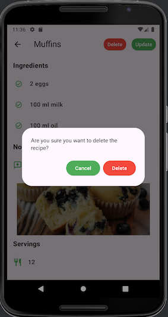

# Recipe App

## Overview

The **Recipe App** is a Flutter-based application designed for cooking enthusiasts. It allows users to explore, save, and manage recipes effortlessly. With an intuitive interface, the app provides ingredient lists and categorization for various cuisines and meal types.

---

## Features

- **Explore Recipes:**  
  Browse all your recipes in one place.

- **Detailed Recipe View:**  
  View comprehensive details for each recipe, including ingredients.

- **Adding Recipe View:**
- You can add the title, servings, ingredients, notes and the image for the recipe.

- **Update Recipe View:**
- You can update every info related to recipe and save it with the new details.

- **Delete Recipe :**
- You can delete the recipe.


---


## Screenshots
Here are some screenshots of the app in action:
### Login Page





## Installation

1. **Clone the Repository:**
   ```bash
   git clone https://github.com/kambericecelia/recipes_app.git
   cd recipe_app
